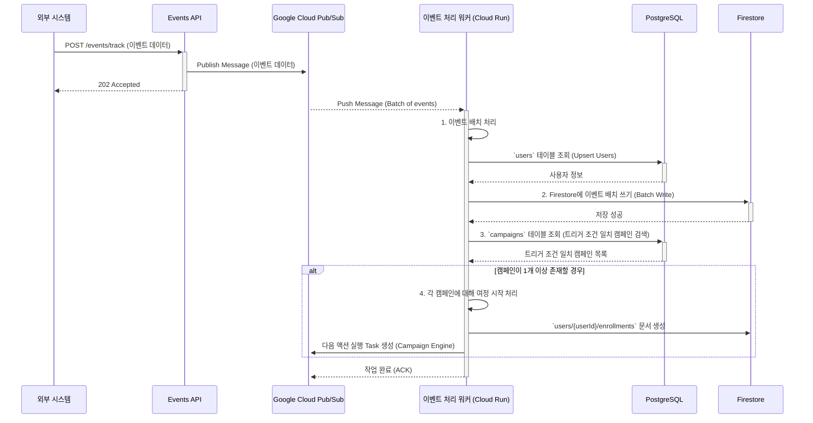

# 3.1.2. 이벤트 처리 흐름 (Event Processing Flow)

## 1. 개요

이 문서는 `Events API`를 통해 수신된 최종 사용자(End-user)의 이벤트가 시스템 내부에서 처리되는 전체 과정을 정의합니다. 이벤트 처리는 **수집**, **처리**, **실행**의 3단계로 구성되며, **Google Cloud Pub/Sub**을 통해 비동기적으로 수행되어 대규모 트래픽에도 안정성과 확장성을 보장합니다.

## 2. 처리 흐름 다이어그램

## 3. 단계별 상세 설명

### 단계 1: 이벤트 수집 (Ingestion)

1.  **API 요청:** 고객사의 클라이언트는 `Events API`로 사용자 이벤트를 전송합니다.
2.  **메시지 발행(Publish):** `Events API` 서버는 최소한의 검증 후, 이벤트 데이터를 즉시 Google Cloud Pub/Sub 토픽(Topic)에 메시지로 발행합니다.
3.  **수신 확인:** 메시지 발행은 매우 빠르므로, API는 즉시 `202Accepted` 응답을 클라이언트에 반환합니다.

### 단계 2: 이벤트 처리 (Processing)

1.  **비동기 실행 (Push Subscription):** Pub/Sub는 토픽을 구독(Subscription)하는 이벤트 처리 워커(Cloud Run)로 메시지를 푸시합니다. Pub/Sub는 여러 이벤트를 자동으로 묶어 **배치(Batch)** 형태로 워커에 전달할 수 있습니다.
2.  **배치 처리:** 워커는 전달받은 이벤트 배치를 순회하며 처리합니다.
3.  **사용자 식별 및 이벤트 저장:** 워커는 PostgreSQL의 `users` 정보를 조회(필요시 Upsert)하고, Firestore의 `users/{userId}/events`에 **배치 쓰기(Batch Write)**를 사용하여 여러 이벤트를 한 번의 트랜잭션으로 효율적으로 저장합니다.
4.  **트리거 검색:** 워커는 수신된 이벤트 유형과 일치하는 시작 조건을 가진 `ACTIVE` 캠페인을 PostgreSQL에서 조회합니다.

### 단계 3: 캠페인 실행 (Execution)

1.  **여정 시작:** 트리거 조건과 일치하는 캠페인이 발견되면, 워커(팀 멤버가 아닌 시스템)는 각 캠페인에 대해 사용자의 여정을 시작시킵니다.
2.  **상태 기록:** `users/{userId}/enrollments`에 캠페인 참여 정보를 기록합니다.
3.  **다음 단계 예약:** 워커는 캠페인 실행 엔진을 위한 새로운 메시지를 Pub/Sub(또는 별도의 Cloud Tasks 큐)에 발행하여 다음 단계를 예약합니다.
