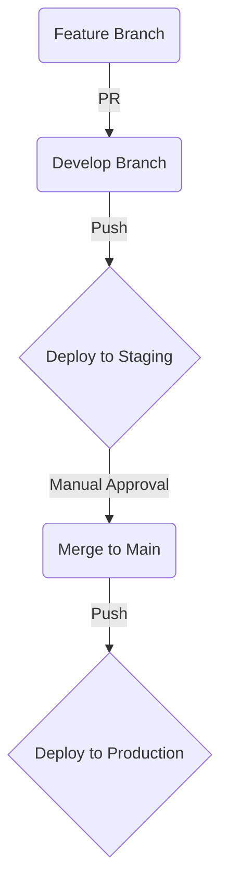

# 3.5. DevOps 및 CI/CD 전략

이 문서는 안정적이고 효율적인 개발 및 배포 파이프라인을 구축하기 위한 정책과 절차를 정의합니다.

## 1. 환경 분리 (Environment Isolation)

안전한 배포와 테스트를 위해, 모든 환경은 별도의 GCP(Google Cloud Platform) 프로젝트로 물리적으로 분리하여 운영합니다.

| 환경 | GCP 프로젝트 ID | 목적 | 데이터 정책 |
| :--- | :--- | :--- | :--- |
| **개발 (dev)** | `piehands-crm-dev` | 개발자의 기능 개발 및 단위 테스트 | 테스트용 더미 데이터 |
| **스테이징 (stg)**| `piehands-crm-staging`| 배포 전 최종 버전의 통합 테스트 및 QA | 프로덕션 데이터의 익명화된 스냅샷 |
| **프로덕션 (prod)**| `piehands-crm-prod` | 실제 고객이 사용하는 라이브 서비스 | 실제 고객 데이터 |

## 2. Git 브랜칭 및 배포 전략

/* --- Backend Note ---
**결정 배경:** 프로젝트 초기에는 빠른 개발 속도와 지속적인 통합을 우선시하기 위해, 가장 널리 쓰이고 직관적인 Git Flow 모델을 채택합니다. `develop` 브랜치를 중심으로 개발하고, 안정화된 버전을 `main` 브랜치에 병합하여 프로덕션에 배포합니다.
*/

- **핵심 브랜치:**
  - `main`: 항상 안정적이며, 배포 가능한 프로덕션 코드를 담고 있는 브랜치.
  - `develop`: 현재 개발 중인 모든 기능이 통합되는 브랜치.
- **지원 브랜치:**
  - `feature/<feature-name>`: 개별 기능 개발을 위한 브랜치. `develop`에서 분기하여 개발 완료 후 다시 `develop`으로 병합(Pull Request)됩니다.

### 자동화된 CI/CD 파이프라인 (GitHub Actions 기준)

1.  **Feature → Develop**: `feature` 브랜치를 `develop`으로 Pull Request(PR) 보내면, 자동으로 유닛 테스트와 코드 린트(Lint) 검사가 실행됩니다. 통과해야만 병합 가능합니다.
2.  **Develop → Staging**: `develop` 브랜치에 새로운 코드가 푸시되면, CI/CD 파이프라인이 자동으로 트리거되어 **스테이징(`stg`) 환경에 배포**합니다.
3.  **Develop → Main**: 스테이징 환경에서 QA가 완료되면, `develop` 브랜치를 `main` 브랜치로 병합(PR)합니다. 이 과정은 수동 승인이 필요합니다.
4.  **Main → Production**: `main` 브랜치에 새로운 코드가 푸시되면, CI/CD 파이프라인이 자동으로 트리거되어 **프로덕션(`prod`) 환경에 배포**합니다.

## 3. 비밀 키 관리 (Secrets Management)

- **정책:** SendGrid API 키, 데이터베이스 접속 정보 등 모든 비밀 키는 코드에 직접 포함되어서는 안 됩니다.
- **구현:** 각 환경(GCP 프로젝트)별로 **Google Secret Manager**를 사용하여 비밀 키를 안전하게 저장합니다. Cloud Run 서비스는 시작 시점에 필요한 키를 Secret Manager에서 직접 읽어와 환경 변수로 주입받습니다. 이를 통해 코드와 민감 정보를 완벽하게 분리합니다.
